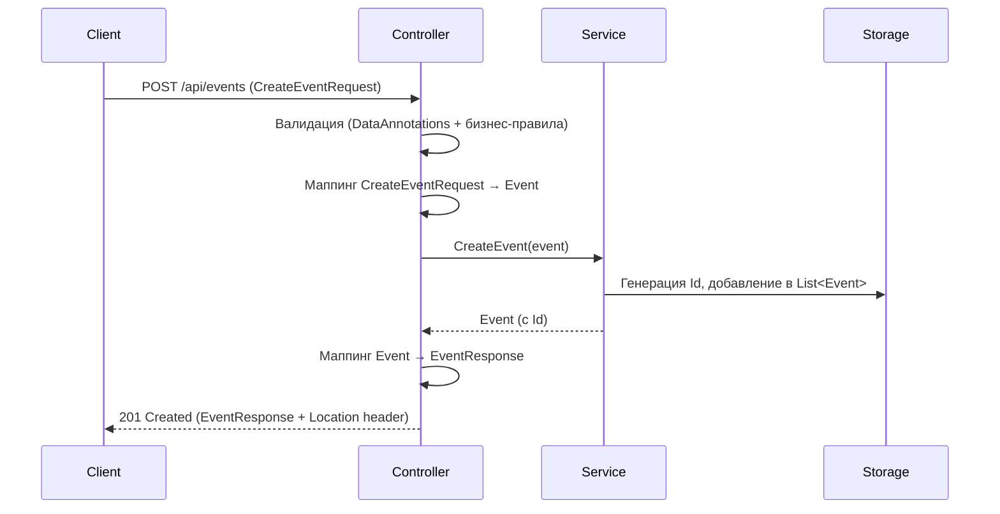
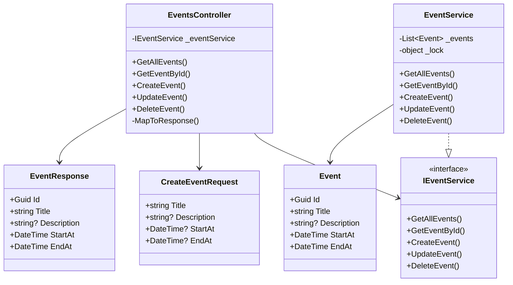
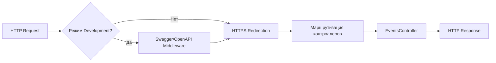
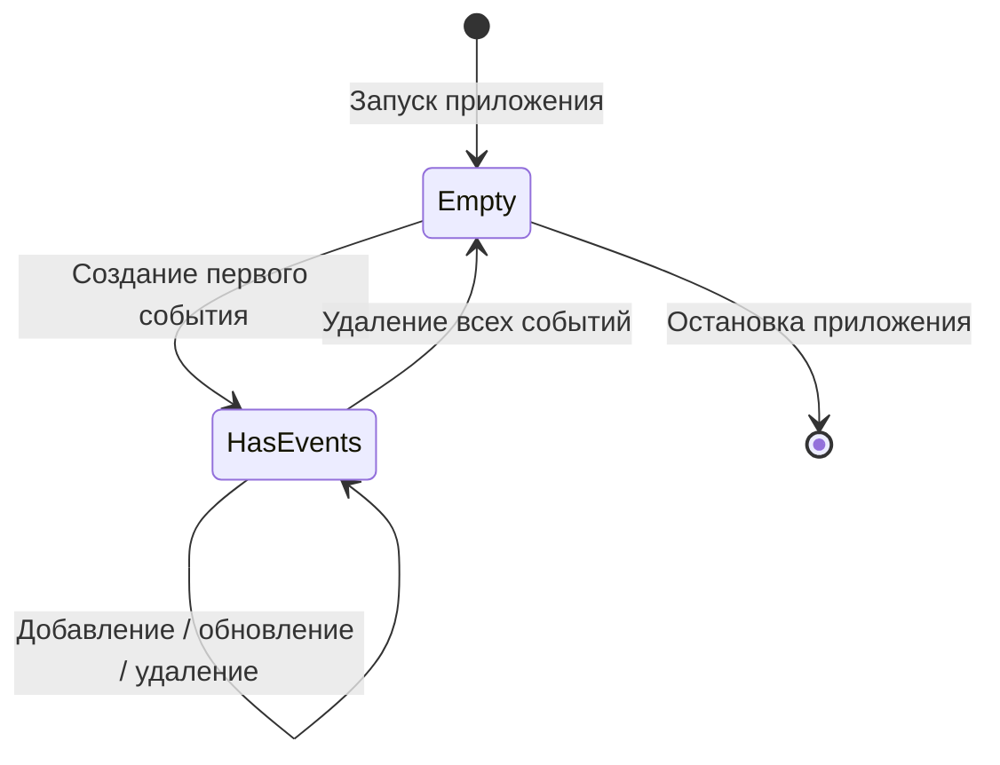
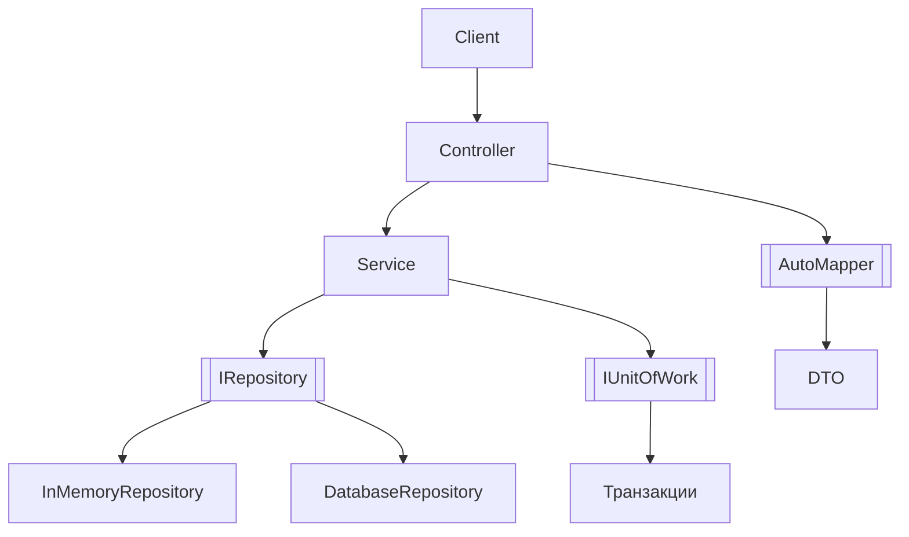

# Диаграммы и визуализация

В этом разделе представлены диаграммы, которые помогают визуализировать архитектуру проекта, поток данных и взаимодействие компонентов. Диаграммы созданы с использованием языка [Mermaid](https://mermaid.js.org/), который поддерживается многими платформами (GitHub, GitLab, VS Code с плагином).

## 1. Общая архитектура слоёв

```mermaid
graph TD
    Client[Клиент (HTTP)] --> Controller[Контроллер EventsController]
    Controller --> Service[Сервис IEventService]
    Service --> Storage[In‑memory хранилище List<Event>]
    
    Controller --> DTO[DTO слой]
    DTO --> Client
    
    subgraph "Слои приложения"
        Controller
        Service
        Storage
        DTO
    end
```

**Пояснение:**  
Клиент отправляет HTTP-запросы к контроллеру. Контроллер использует сервис для выполнения бизнес-логики. Сервис работает с in‑memory хранилищем. Контроллер преобразует данные в DTO и возвращает клиенту.

## 2. Поток данных при создании события (POST)



**Пояснение:**  
Последовательность шагов от получения запроса до ответа. Обратите внимание на два этапа маппинга (DTO→Модель и Модель→DTO) и генерацию Id на стороне сервиса.

## 3. Взаимосвязь компонентов (зависимости)



**Пояснение:**  
Диаграмма классов показывает зависимости между основными компонентами. Контроллер зависит от интерфейса `IEventService`, а `EventService` реализует этот интерфейс и работает с моделью `Event`. DTO используются только контроллером.

## 4. Конвейер HTTP-запросов (Middleware pipeline)



**Пояснение:**  
В development-режиме запрос сначала проходит через Swagger Middleware (для обслуживания UI и OpenAPI). Затем применяется перенаправление на HTTPS (если запрос пришёл по HTTP). Далее запрос маршрутизируется к соответствующему методу контроллера.

## 5. Состояние данных в памяти



**Пояснение:**  
In‑memory хранилище начинается с пустого состояния. При создании событий переходит в состояние «есть события». Все операции CRUD происходят внутри этого состояния. Если все события удалены, хранилище снова становится пустым. При остановке приложения данные теряются.

## 6. Альтернативная архитектура (с репозиторием)

Для сравнения приведём диаграмму улучшенной архитектуры, которая могла бы быть использована в production:



**Пояснение:**  
Введение репозитория абстрагирует доступ к данным, позволяя подменять реализацию (in‑memory, база данных). Unit of Work управляет транзакциями. AutoMapper автоматизирует маппинг между объектами.

## Как использовать эти диаграммы

1. **В VS Code** установите расширение "Markdown Preview Mermaid Support" для просмотра диаграмм прямо в preview.
2. **На GitHub** диаграммы Mermaid отображаются автоматически в файлах `.md`.
3. **Для презентаций** можно скопировать код диаграммы в [Mermaid Live Editor](https://mermaid.live/) и экспортировать как изображение.

Диаграммы помогают быстро понять структуру проекта, не погружаясь в код, и служат отличным дополнением к текстовой документации.

---

[К оглавлению документации](../README.md) | [Назад: Тестирование и запуск](05-testing-deployment.md)