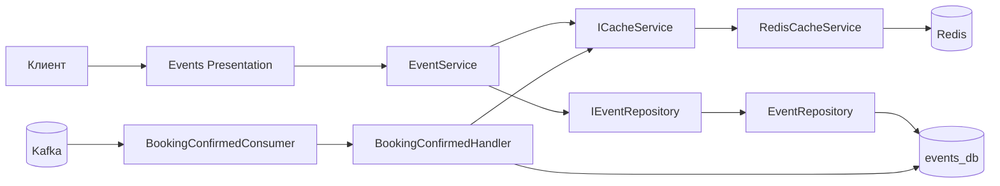
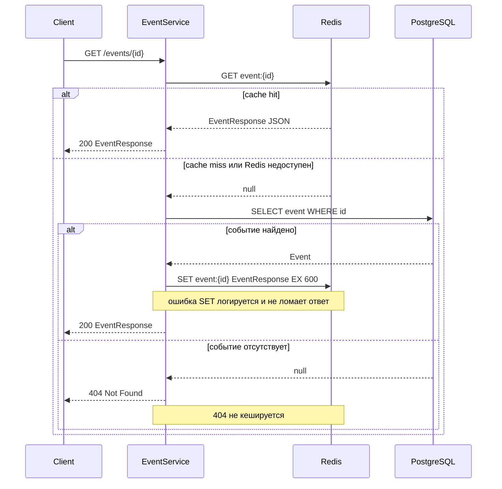
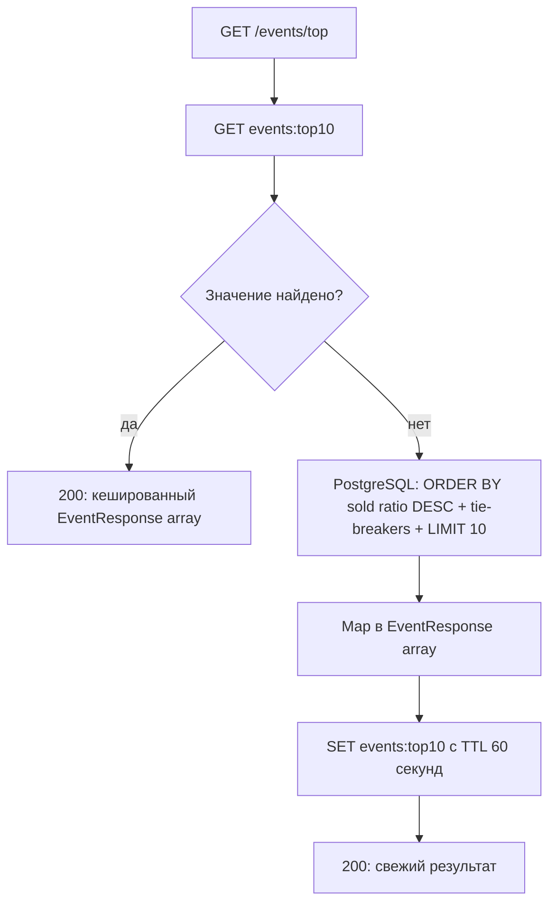
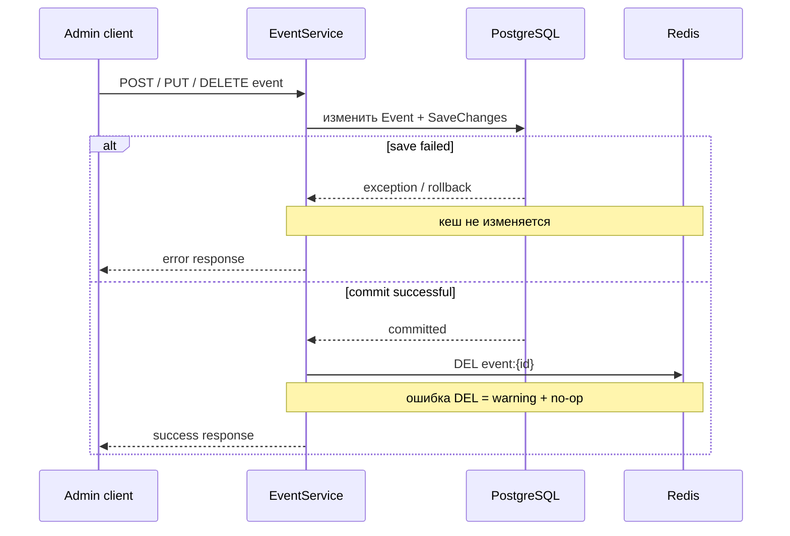
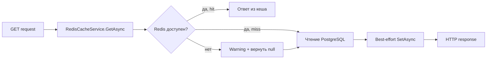
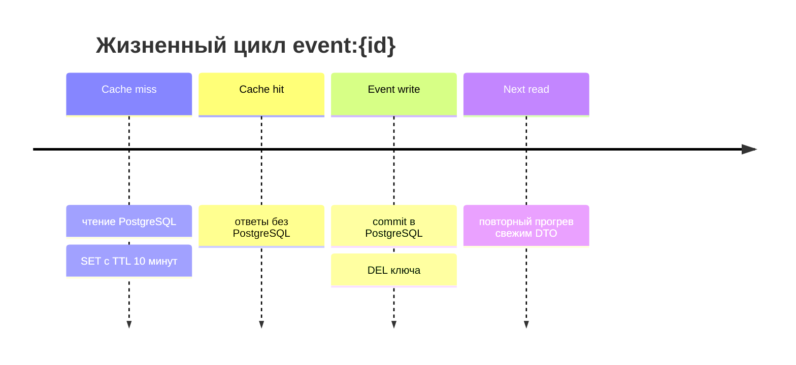

# Диаграммы sprint 10

## 1. Redis в архитектуре Events



Application зависит от `ICacheService`, а не от StackExchange.Redis. Redis остаётся производной копией PostgreSQL-данных.

## 2. `GET /events/{id}`: Cache-Aside



## 3. `GET /events/top`: топ-10 и TTL



Пустой массив также проходит через `SET`. CRUD и Kafka не удаляют `events:top10`; актуальность ограничивается минутным TTL.

## 4. HTTP-мутация: commit перед инвалидацией



Удаление ключа до commit запрещено: cache miss между `DEL` и `SaveChanges` мог бы заново прогреть старое значение.

## 5. Kafka: изменение мест и кеш

```mermaid
flowchart TD
    Msg[BookingConfirmed] --> Dup{booking_id уже в Inbox?}
    Dup -- да --> Noop[no-op: кеш не менять]
    Dup -- нет --> Valid{Event найден, не начался, мест хватает?}
    Valid -- нет --> Skip[записать skipped Inbox result: кеш не менять]
    Valid -- да --> Tx[уменьшить AvailableSeats + записать Inbox + commit]
    Tx --> Del[DEL event:{eventId} с CancellationToken.None]
    Del --> CommitOffset[Kafka consumer commit offset]

    Del -. не затрагивает .-> Top[events:top10 живёт до TTL]
```

Инвалидация стоит после транзакции Event + Inbox, но до успешного завершения handler. Неотменяемый token не позволяет остановке host пропустить единственную попытку удалить ключ после commit.

## 6. Деградация Redis



Отказ Redis меняет только производительность: путь через PostgreSQL и HTTP-результат сохраняются.

## 7. TTL и инвалидация



Для `events:top10` этап `DEL` отсутствует: после `SET` ключ живёт не более одной минуты и затем пересчитывается при следующем запросе.

---

[Назад к README спринта](README.md)
