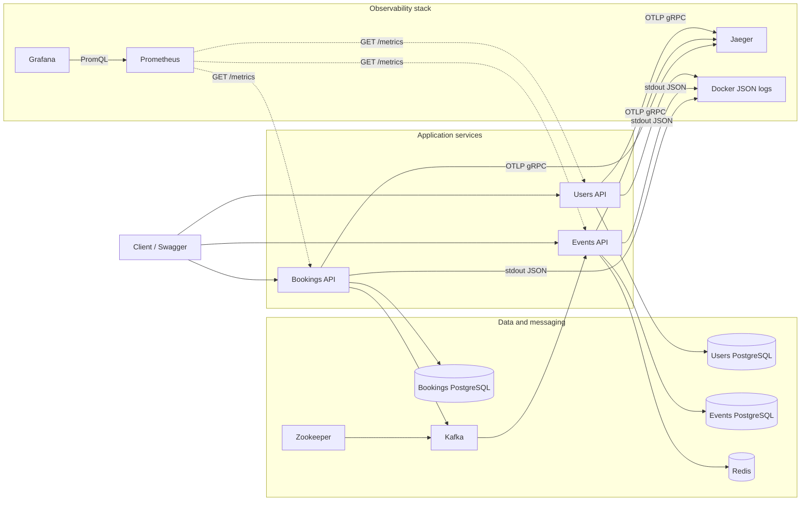
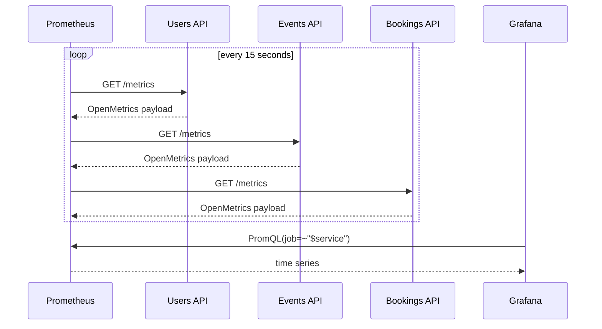
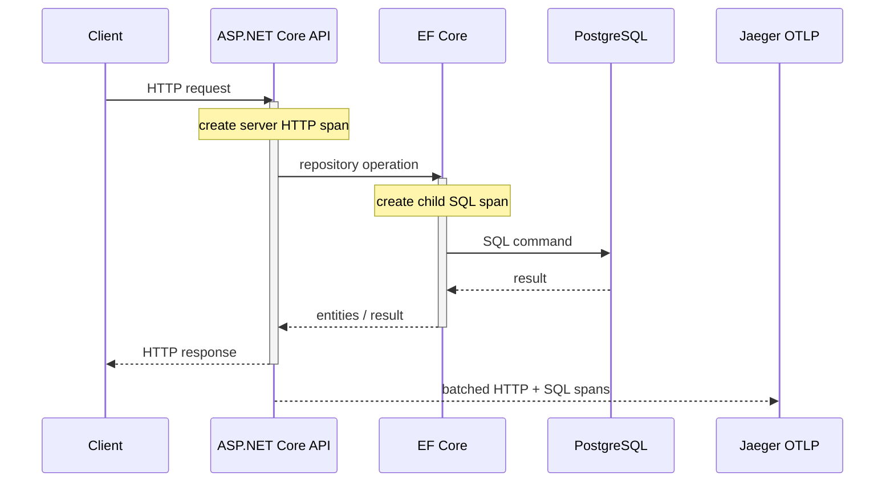
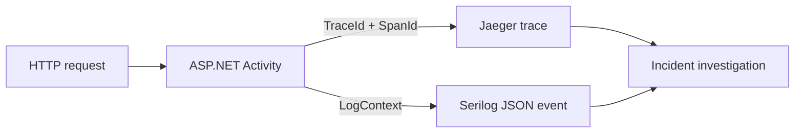
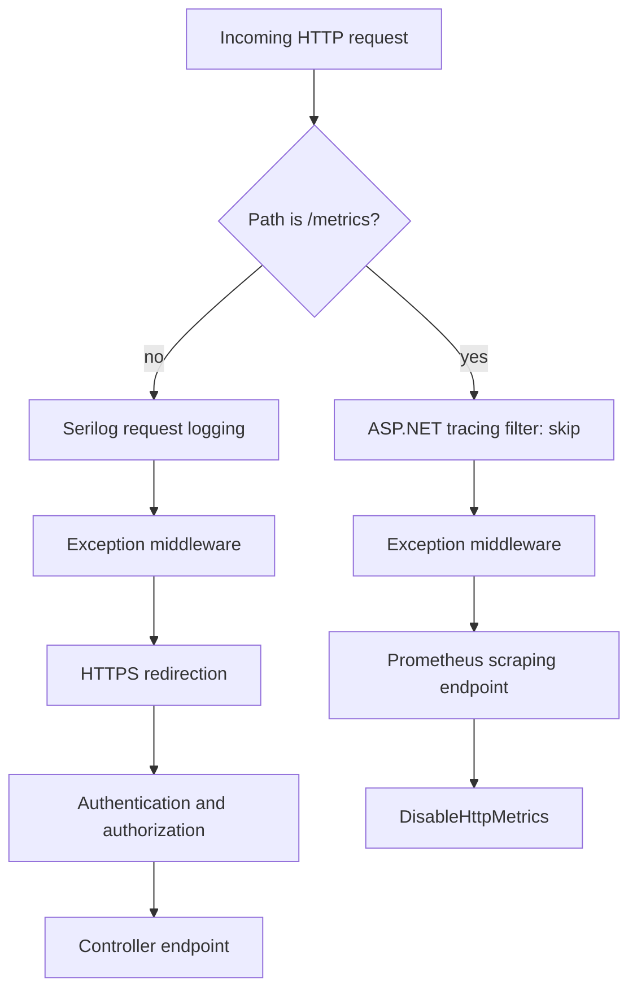
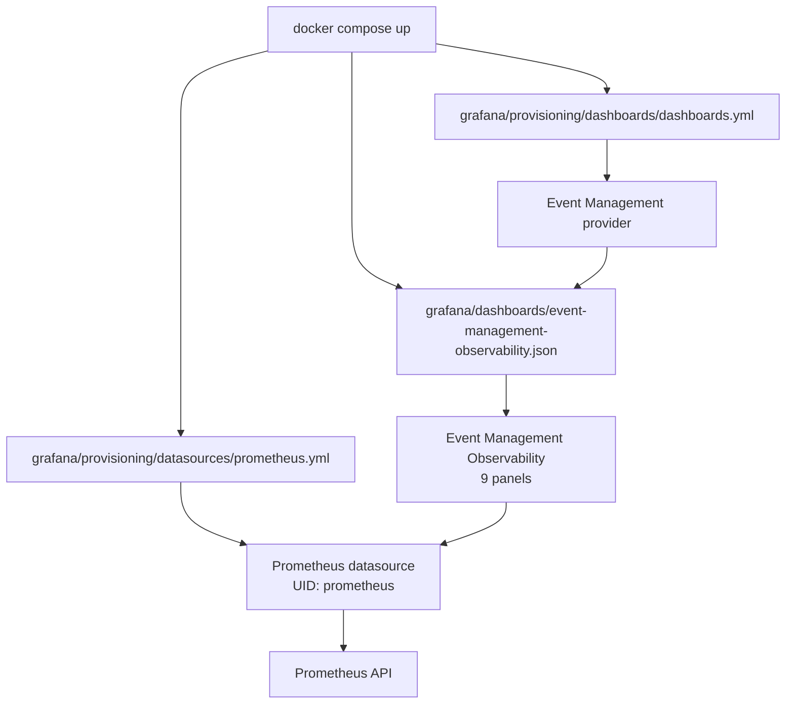
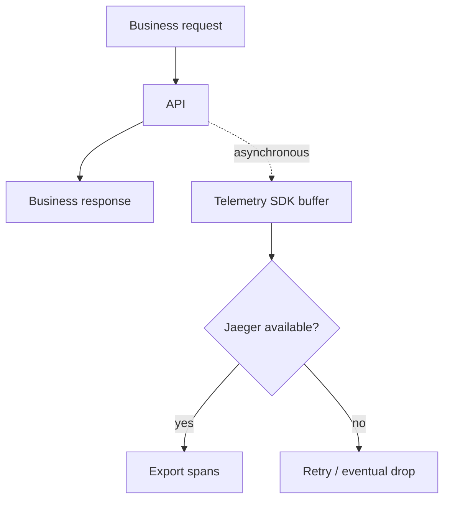
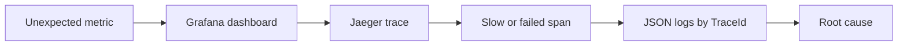

# Диаграммы

## 1. Полная топология

## 2. Pull-модель метрик

Prometheus инициирует сбор. API не знают адрес Prometheus и не отправляют ему данные самостоятельно.

## 3. HTTP- и SQL-спаны

Одинаковый trace context связывает HTTP parent со спанами доступа к данным.

## 4. Корреляция логов и трейсов

Оператор находит ошибочный запрос по метрике, открывает trace и затем фильтрует JSON-логи по тому же `TraceId`.

## 5. Ветка `/metrics`

Ветка сохраняет общую обработку ошибок, но исключает HTTPS redirect, request log, trace и самонаблюдение HTTP-метрик.

## 6. Provisioning Grafana

Все настройки воспроизводятся из Git; ручные действия после старта контейнера не нужны.

## 7. Деградация monitoring backend

Экспорт выполняется вне критического пути. Недоступность Jaeger не должна задерживать или отменять бизнес-ответ.

## 8. Цикл диагностики

Назад к [обзору Sprint 11](README.md) или к [общей документации](../README.md).
