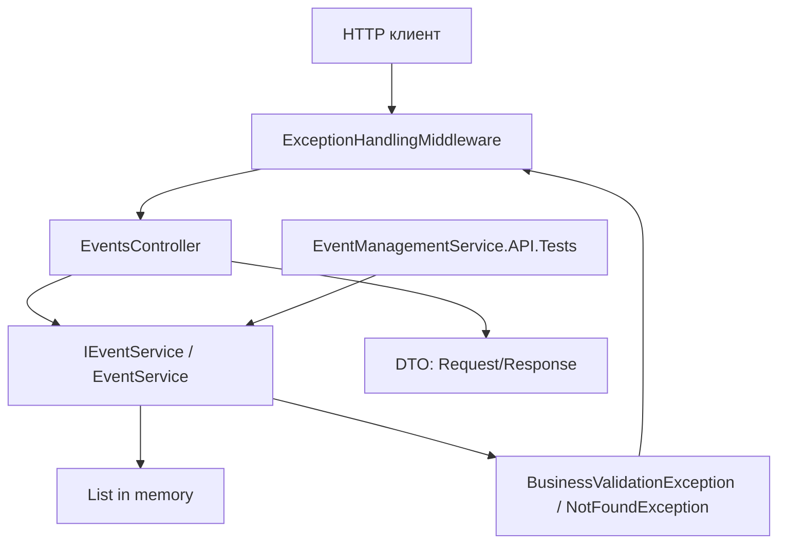
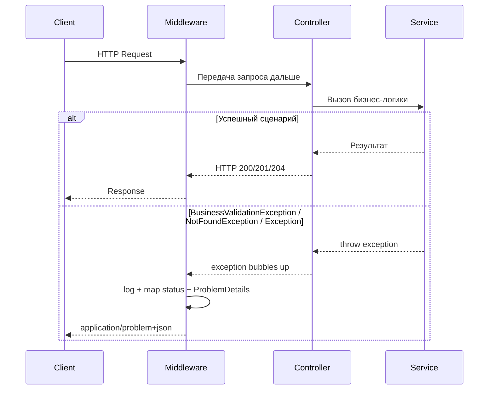
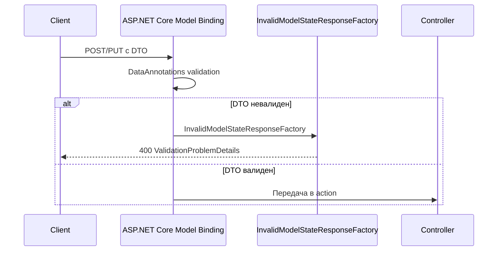
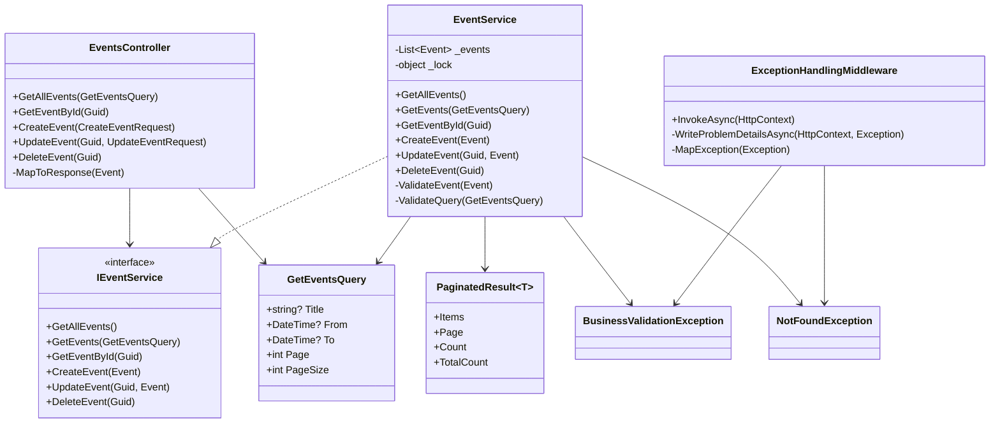
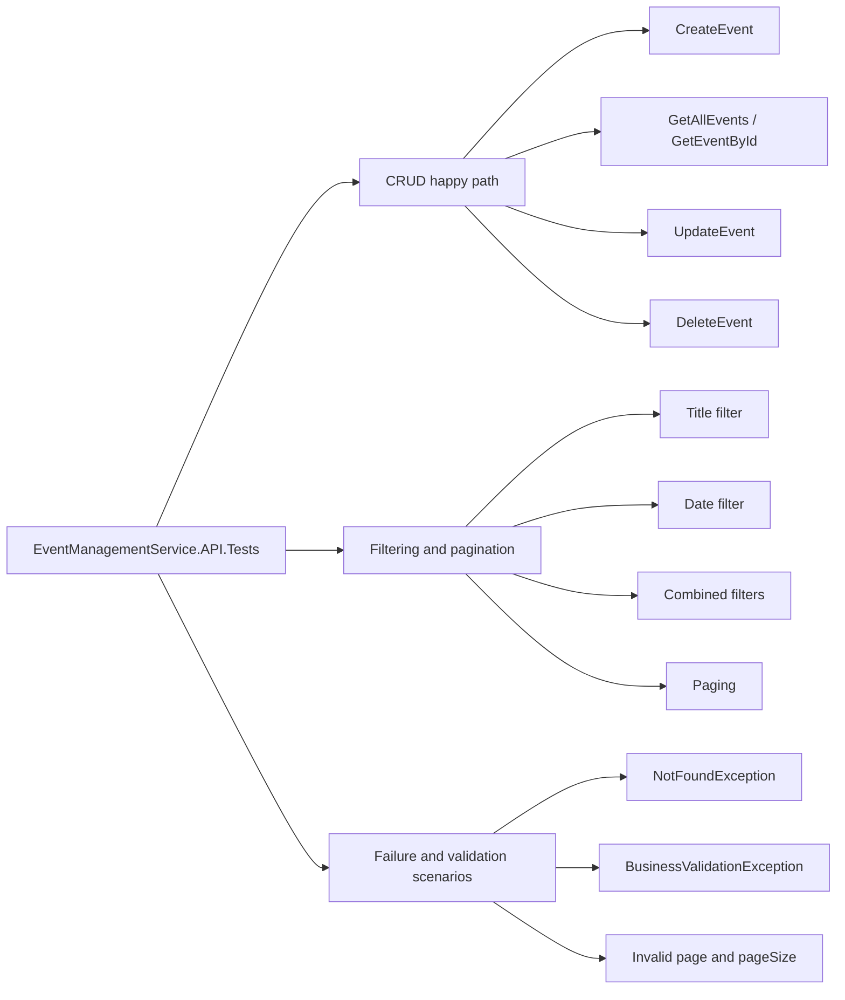
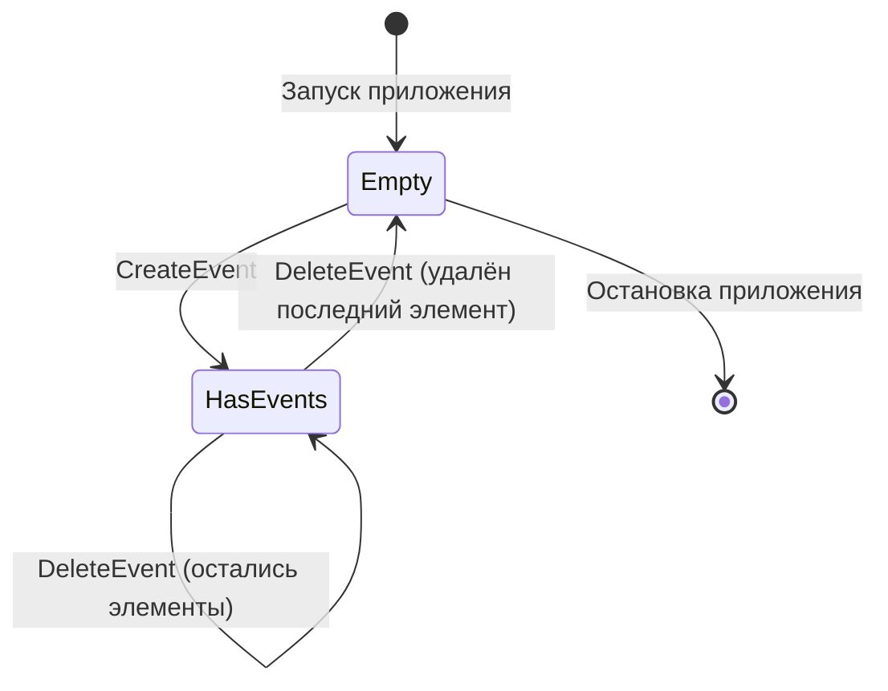

# Диаграммы и визуализация sprint 2

В этом разделе приведены Mermaid-диаграммы, которые помогают быстро увидеть, как после sprint 2 устроены:

- слои приложения;
- обработка ошибок;
- фильтрация и пагинация;
- тестовый слой.

## 1. Общая архитектура после sprint 2



**Пояснение:**  
Клиент проходит через middleware, затем попадает в контроллер. Контроллер вызывает сервис. Сервис работает с in-memory хранилищем и при ошибках бросает доменные исключения, которые снова обрабатываются middleware. Тесты проверяют сервис напрямую.

## 2. Конвейер HTTP-запроса с ошибками



**Пояснение:**  
Контроллер не занимается ручным `try/catch`. Исключение поднимается вверх по pipeline и обрабатывается единым middleware.

## 3. Отдельный путь model validation



**Пояснение:**  
Не все ошибки проходят через middleware. Ошибки model validation могут завершить запрос ещё до вызова action, поэтому для них нужен отдельный factory в `Program.cs`.

## 4. Фильтрация и пагинация в `EventService`

```mermaid
flowchart TD
    Start[GetEvents(query)] --> Validate[ValidateQuery]
    Validate --> Snapshot[Снять snapshot списка под lock]
    Snapshot --> Title{Title задан?}
    Title -->|Да| FilterTitle[Where Title Contains]
    Title -->|Нет| FromCheck
    FilterTitle --> FromCheck{From задан?}
    FromCheck -->|Да| FilterFrom[Where StartAt >= From]
    FromCheck -->|Нет| ToCheck
    FilterFrom --> ToCheck{To задан?}
    ToCheck -->|Да| FilterTo[Where EndAt <= To]
    ToCheck -->|Нет| Sort
    FilterTo --> Sort[OrderBy StartAt]
    Sort --> Count[Count filtered]
    Count --> SkipTake[Skip + Take]
    SkipTake --> Result[PaginatedResult]
```

**Пояснение:**  
Запрос строится поэтапно. Каждый фильтр применяется только при наличии параметра. В конце результат сортируется и только потом пагинируется.

## 5. Диаграмма классов ключевых компонентов sprint 2



**Пояснение:**  
Диаграмма показывает, что логика распределена между контроллером, сервисом и middleware, а DTO и исключения играют роль контрактов между слоями.

## 6. Покрытие тестами



**Пояснение:**  
Тесты покрывают не один узкий участок, а весь сервисный контракт sprint 2: операции, чтение списка и ошибки.

## 7. Жизненный цикл данных в памяти



**Пояснение:**  
Хранилище остаётся in-memory, поэтому все данные существуют только в течение жизни процесса.

## Как использовать диаграммы

1. Читать вместе с кодом в `Program.cs`, `EventService.cs` и `ExceptionHandlingMiddleware.cs`.
2. Открывать в Markdown preview с поддержкой Mermaid.
3. Использовать как быстрый “map of the system”, когда не хочется сразу читать исходники.

Диаграммы особенно полезны перед code review или перед повторным входом в проект после перерыва.

---

[Назад: Тестирование и запуск](05-testing-and-run.md) | [К оглавлению документации](README.md)
