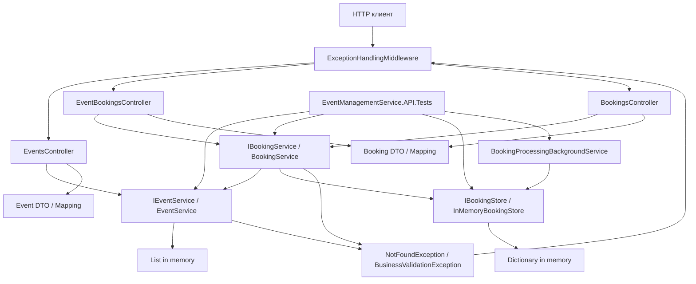
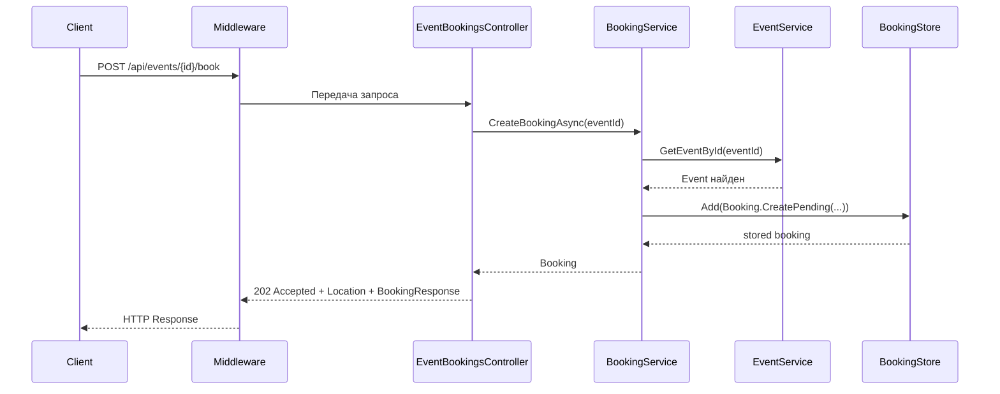
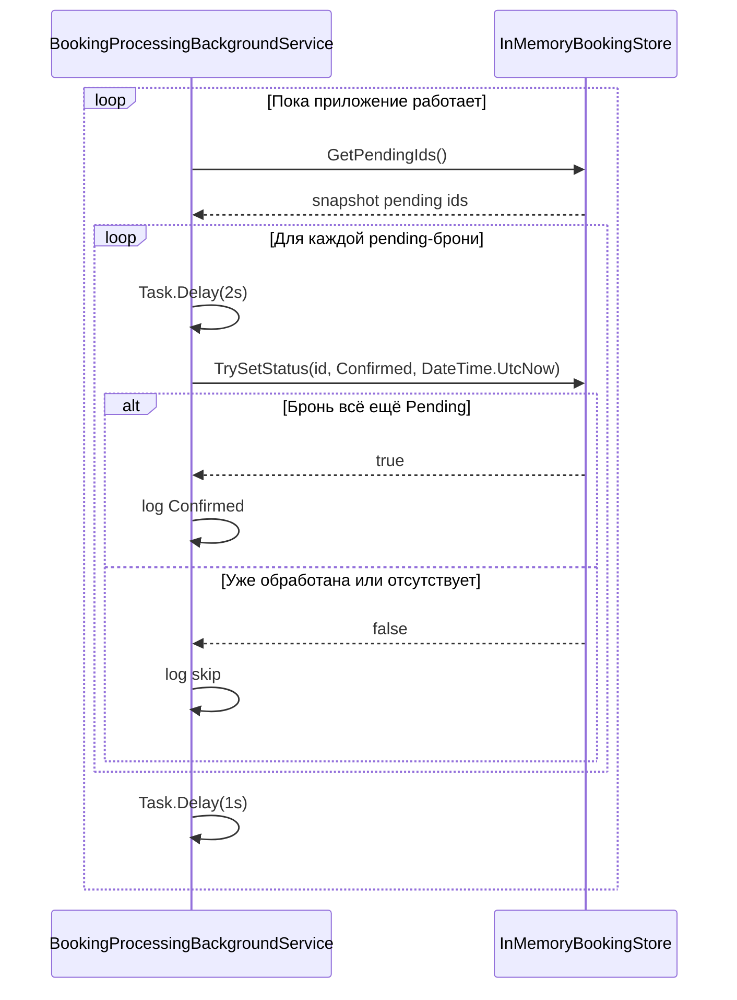
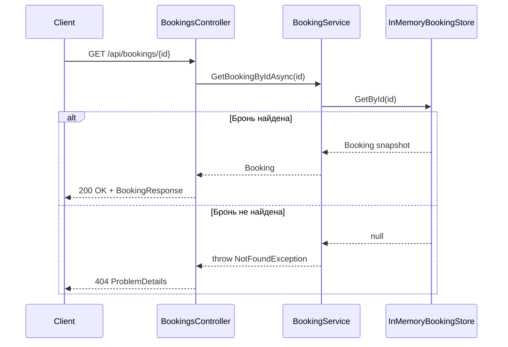
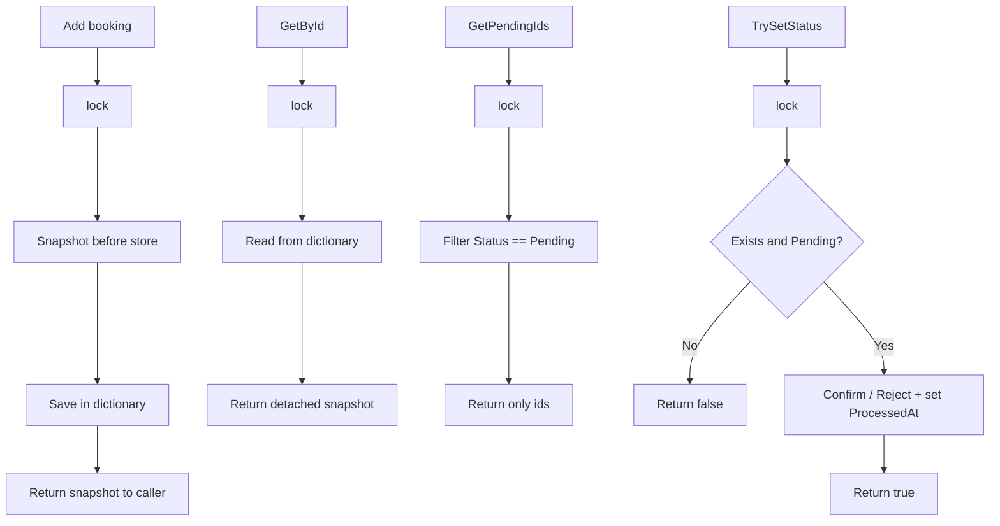
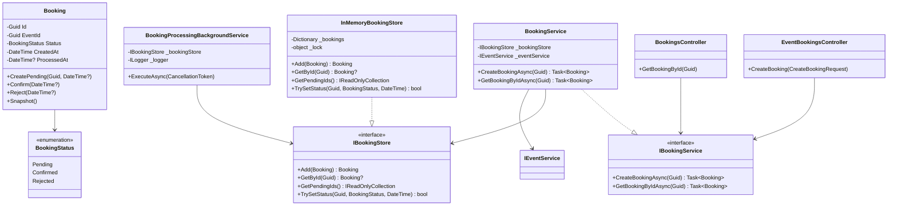
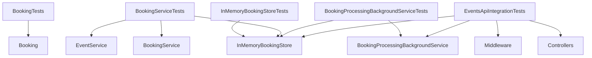

# Диаграммы и визуализация sprint 3

В этом разделе приведены Mermaid-диаграммы, которые помогают быстро увидеть, как после sprint 3 устроены:

- слои приложения;
- создание брони с `202 Accepted`;
- фоновая обработка pending-броней;
- взаимодействие store, сервиса и worker'а;
- тестовый слой.

## 1. Общая архитектура после sprint 3

**Пояснение:**  
После sprint 3 у проекта появляется второй контур логики: бронирования. `BookingService` зависит от `IEventService` и `IBookingStore`, а `BookingProcessingBackgroundService` использует тот же самый store. Это и есть центральная архитектурная идея спринта.

## 2. HTTP-сценарий создания брони

**Пояснение:**  
В момент ответа клиент получает уже существующий ресурс брони, но ещё не конечный статус обработки. Поэтому используется `202 Accepted`, а не `201 Created`.

## 3. Асинхронная обработка брони worker'ом

**Пояснение:**  
Worker последовательно обрабатывает pending-записи, делает искусственную задержку и затем переводит бронь в `Confirmed`. Между итерациями цикла есть дополнительная пауза опроса.

## 4. Поток чтения состояния брони

**Пояснение:**  
`GET /api/bookings/{id}` нужен именно для наблюдения за асинхронным жизненным циклом брони.

## 5. Диаграмма store и snapshot-логики

**Пояснение:**  
Store не отдаёт наружу внутренние объекты как есть. Вместо этого он работает через snapshot'ы и тем самым отделяет внутреннее состояние от внешнего кода.

## 6. Диаграмма классов основных компонентов sprint 3

**Пояснение:**  
Это основной “срез классов” sprint 3. Здесь хорошо видно, что `Booking` — это доменная модель, `BookingService` — прикладной сервис, `InMemoryBookingStore` — shared state, а worker — отдельный фоновой компонент.

## 7. Тестовый слой после sprint 3

**Пояснение:**  
Тестовый слой теперь покрывает проект на нескольких уровнях: модель, store, сервис, worker и HTTP-контракт целиком.
