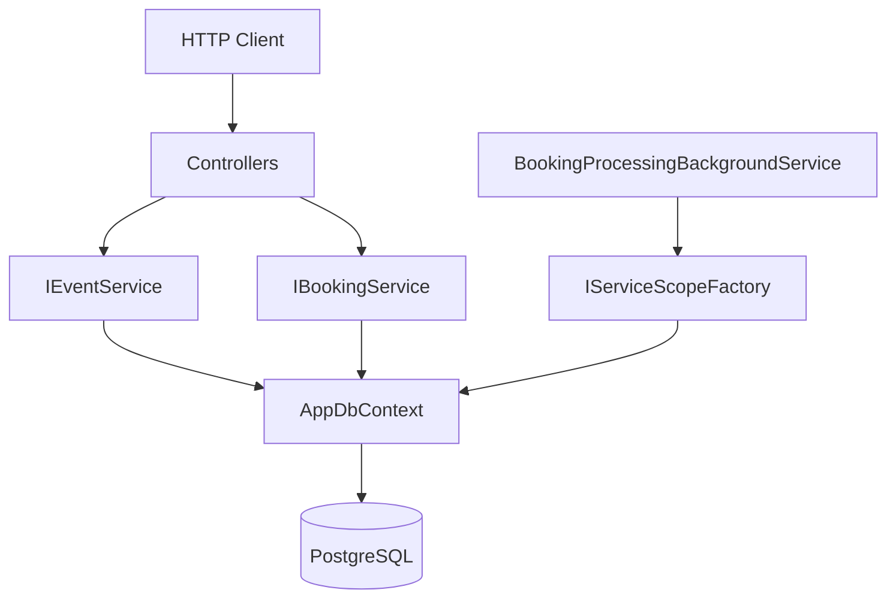
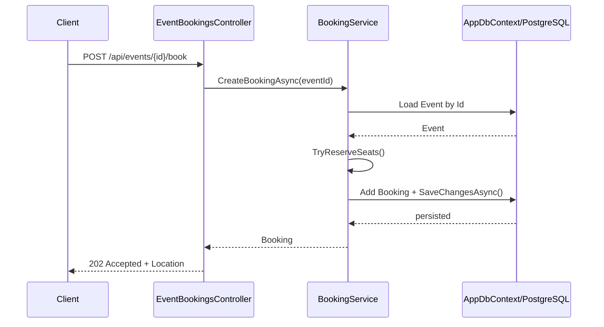
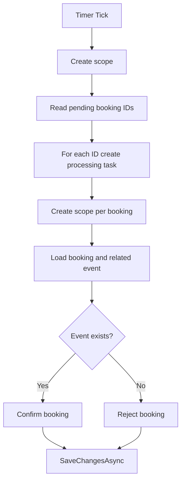
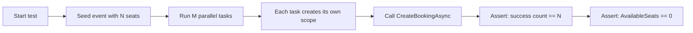

# Диаграммы sprint 5

## 1. Архитектура после миграции на EF Core

## 2. Поток создания бронирования

## 3. Работа фонового обработчика

## 4. Тест конкурентного бронирования

## 5. Контрольные вопросы

1. Почему `DbContext` должен быть scoped?
2. Зачем `BackgroundService` нужен `IServiceScopeFactory`?
3. Почему конкурентные тесты создают отдельный scope на запрос?
4. Как `EnsureCreated` помогает в учебном проекте?

---

[Назад к README спринта](README.md)
