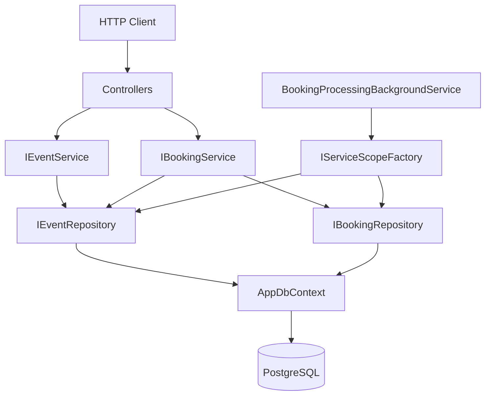
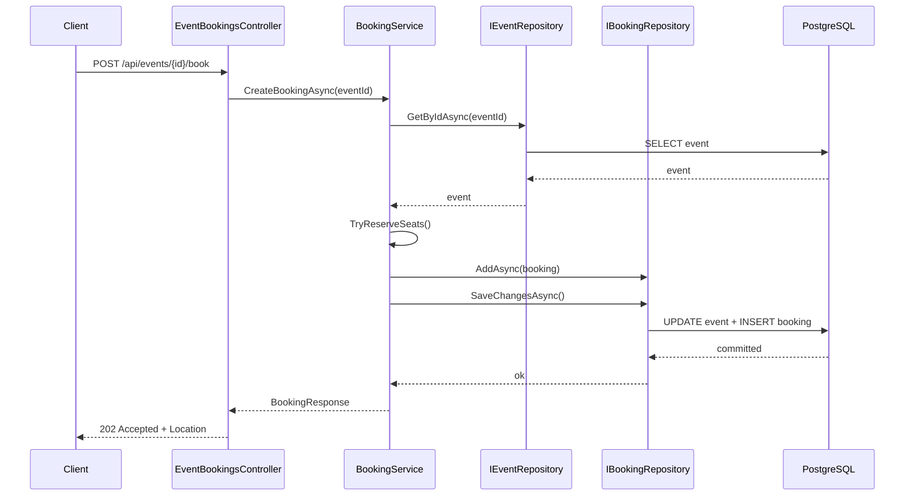
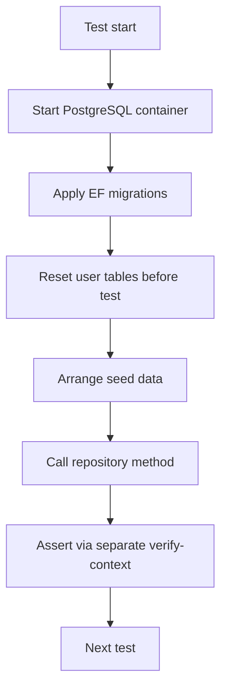
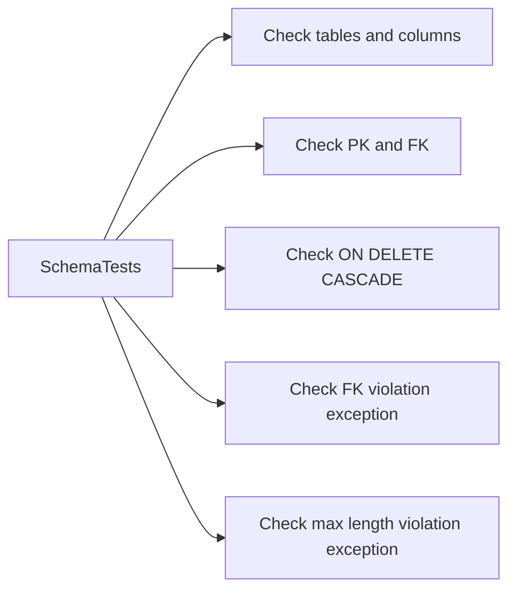

# Диаграммы sprint 6

## 1. Архитектура после перехода на репозитории и миграции

## 2. Поток создания бронирования

## 3. Поток integration tests с Testcontainers

## 4. Проверка схемы и ограничений

## 5. Контрольные вопросы

1. Почему migration-first лучше `EnsureCreated` для развивающейся схемы?
2. Что дает слой репозиториев между сервисом и `DbContext`?
3. Зачем нужен verify-context в интеграционных тестах записи?
4. Какие ошибки можно поймать только на реальном PostgreSQL, но не в InMemory?

---

[Назад к README спринта](README.md)
