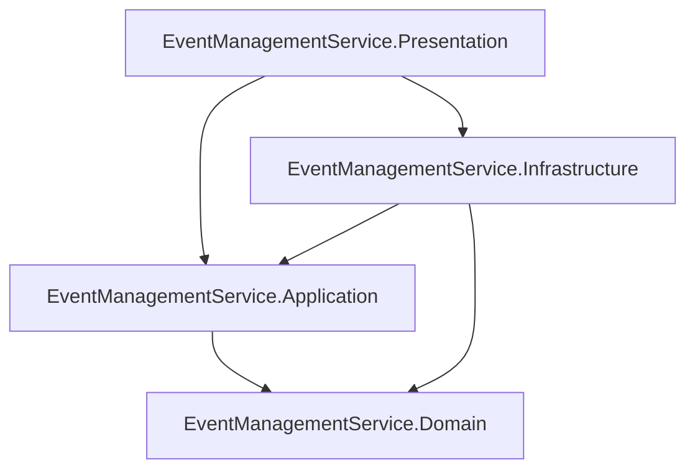
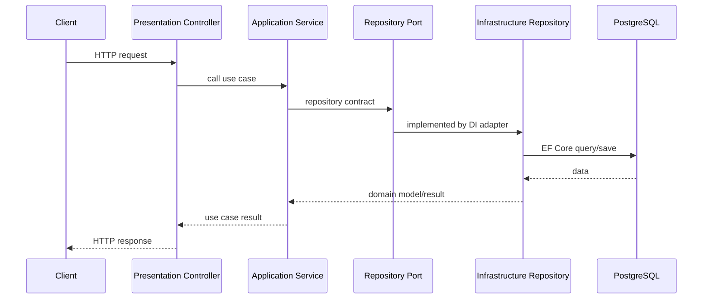
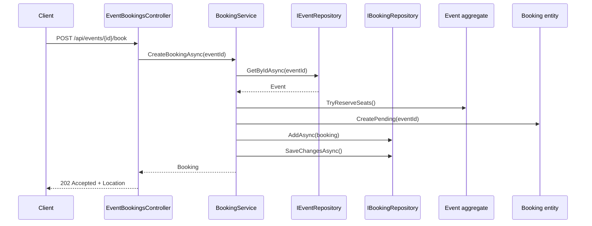
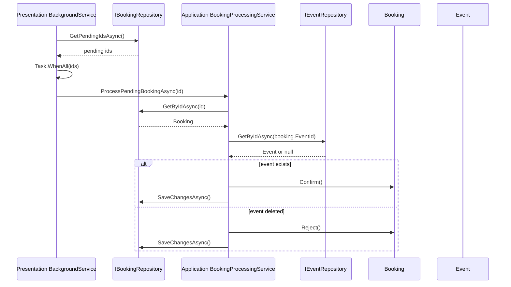
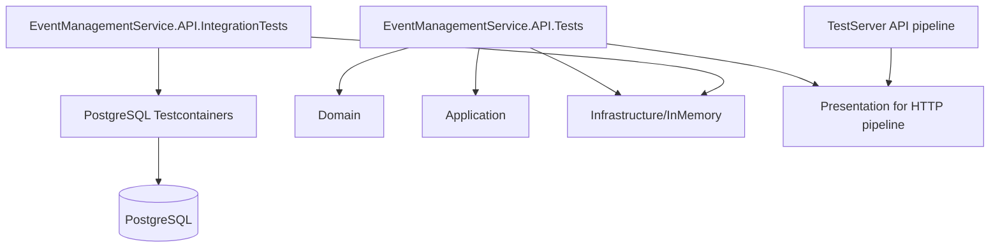
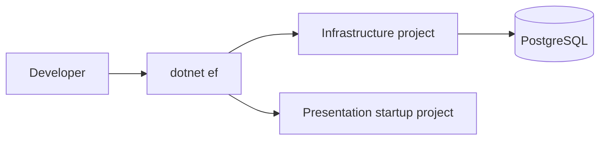

# Диаграммы sprint 7

## 1. Зависимости production-проектов



Запрещенное направление:

```text
Domain -> outward
Application -> Infrastructure
Application -> Presentation
```

## 2. HTTP request flow



## 3. Booking creation flow



## 4. Background booking processing



## 5. Test architecture



## 6. EF Core migration flow



Команда:

```bash
dotnet ef migrations add <MigrationName> \
  --project src/EventManagementService.Infrastructure/EventManagementService.Infrastructure.csproj \
  --startup-project src/EventManagementService.Presentation/EventManagementService.Presentation.csproj
```

---

[К началу sprint 7 docs](README.md)
