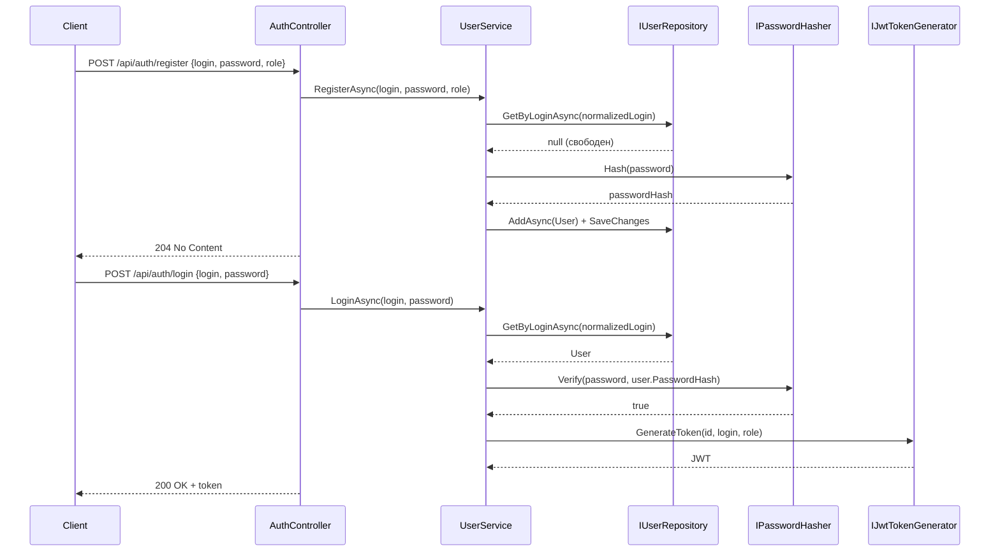
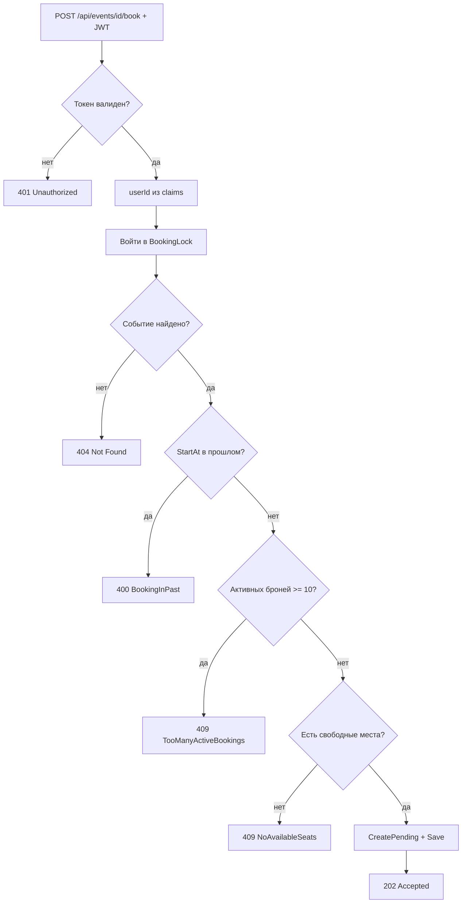
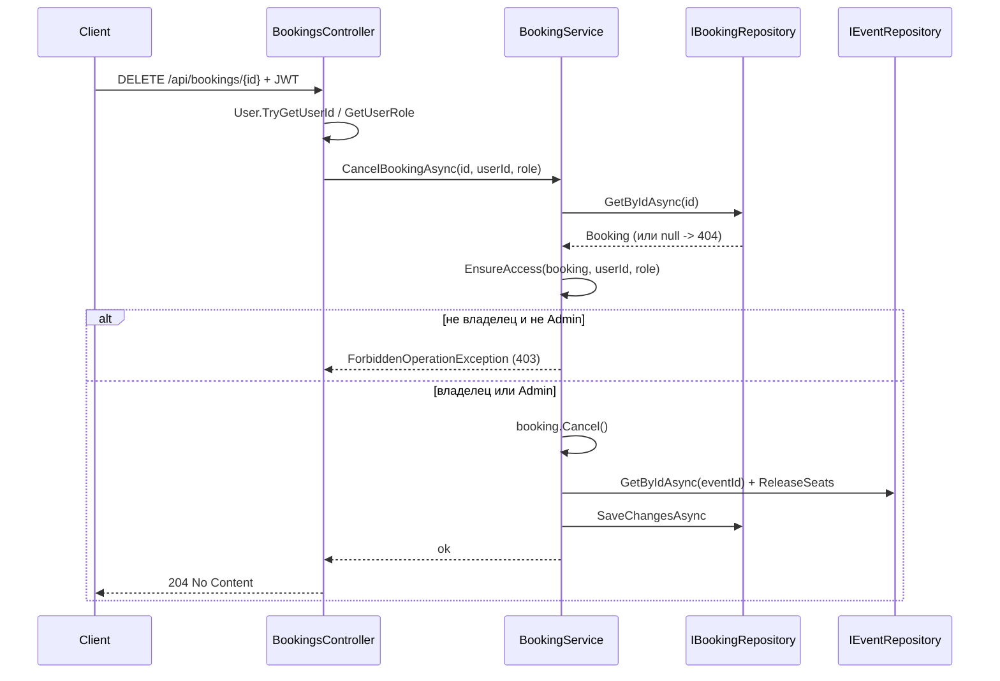
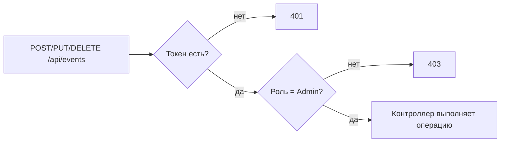
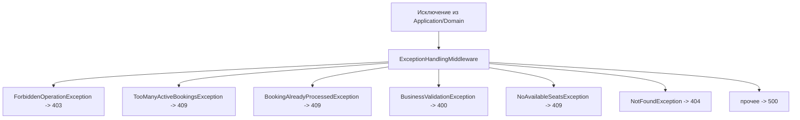
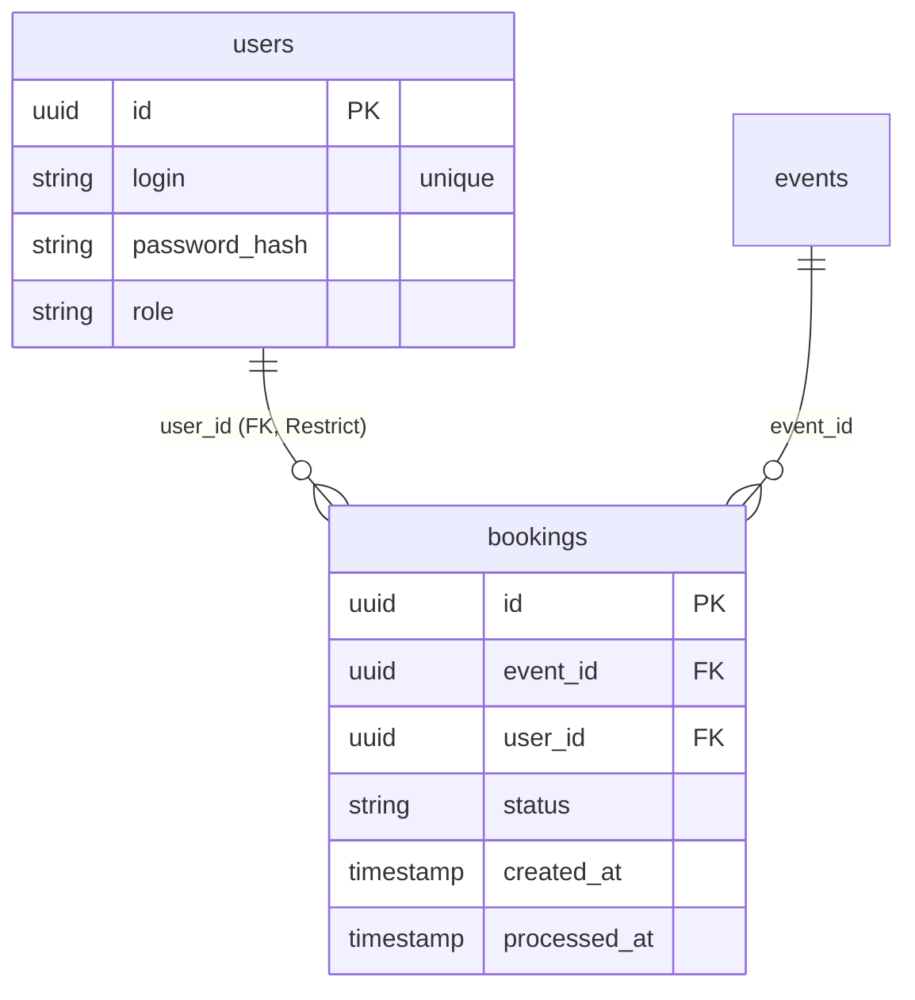

# Диаграммы sprint 8

## 1. Регистрация и логин

При неверных учётных данных `LoginAsync` бросает `NotFoundException` → `404` с единым сообщением (защита от перебора пользователей).

## 2. Создание брони с проверкой правил

## 3. Отмена брони и решение об авторизации

Правило «владелец или администратор» проверяется в Application (`EnsureAccess`), а не в контроллере, поэтому соблюдается при любом способе вызова use case.

## 4. Авторизация по ролям на событиях

`[Authorize(Roles = "Admin")]` отдаёт `401` без токена и `403` для обычного пользователя ещё до входа в контроллер.

## 5. Маппинг исключений в HTTP-коды

Наследники `BusinessValidationException` (`Forbidden`, `TooMany`, `AlreadyProcessed`) стоят в `switch` выше базового типа, иначе их коды схлопнулись бы в `400`.

## 6. Связь таблиц после миграции

---

[К началу sprint 8 docs](README.md)
