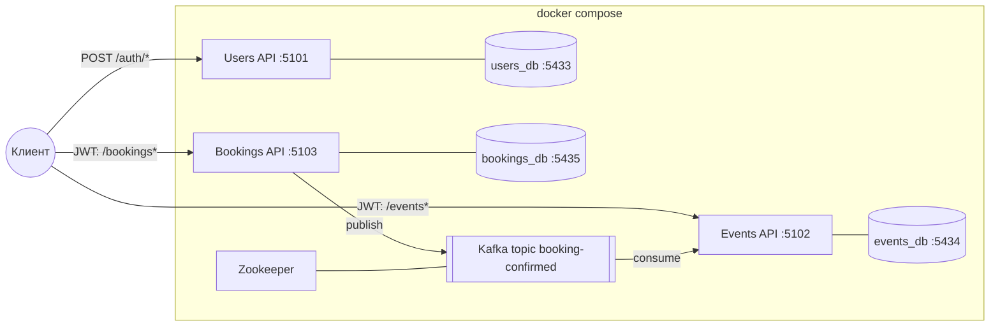
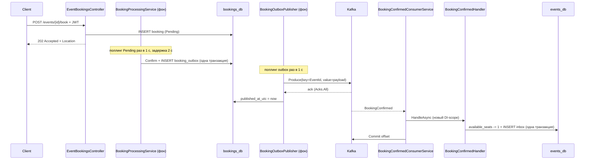
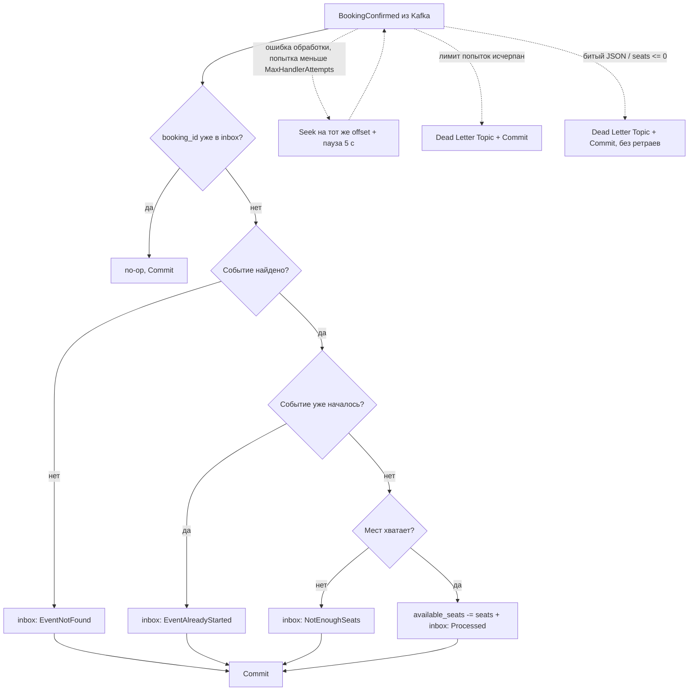
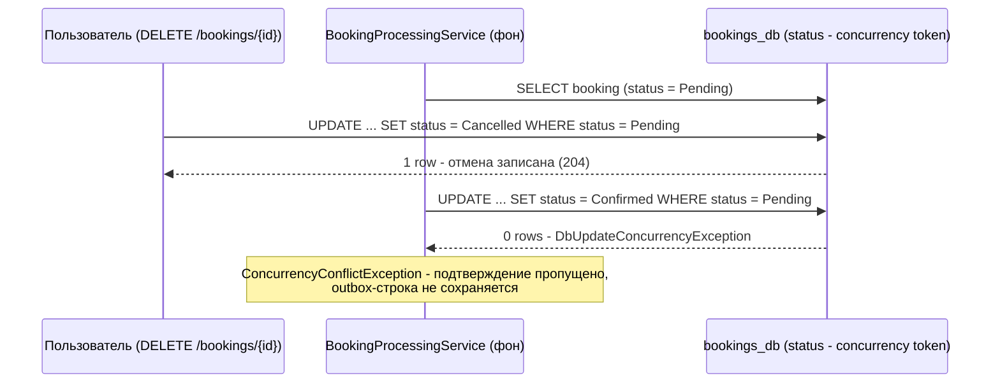
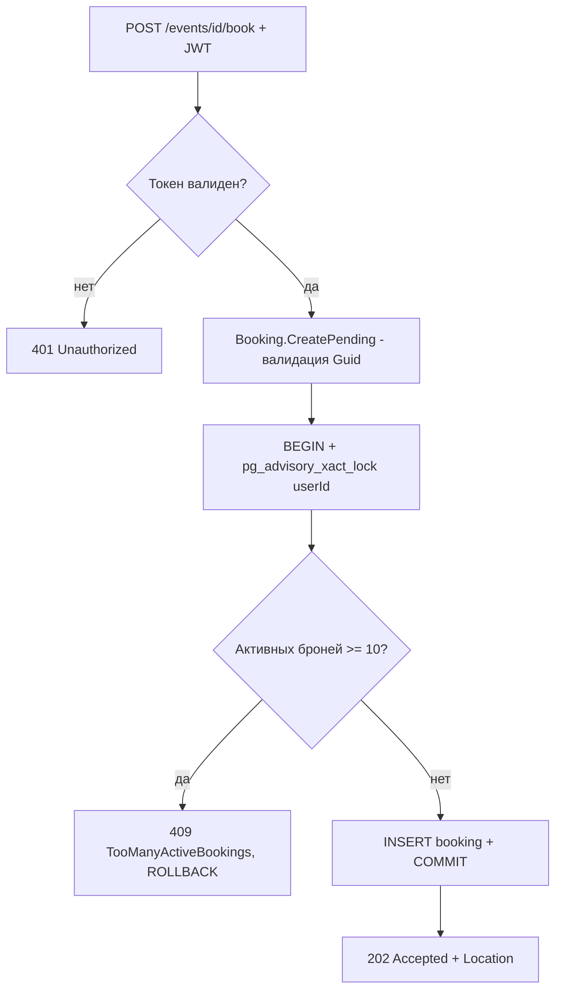

# Диаграммы sprint 9

## 1. Контейнерная схема системы

Между сервисами нет ни одной HTTP-стрелки: единственный канал — Kafka. Один JWT (общие secret/issuer/audience) принимают все три API.

## 2. Поток BookingConfirmed: от брони до уменьшения мест

Две локальные транзакции (в Bookings и в Events) связаны сообщением — глобальной транзакции нет, согласованность достигается в конечном счёте.

## 3. Логика обработчика сообщения (идемпотентность и крайние случаи)

Каждая ветка с записью inbox — одна транзакция БД. `Commit` оффсета выполняется только после успешного сохранения, поэтому сбой БД не теряет сообщение — оно будет повторено через `Seek`, пока не исчерпается лимит попыток; после этого (или сразу для заведомо невалидных сообщений) — изоляция в Dead Letter Topic (см. [03-messaging-and-consistency.md](03-messaging-and-consistency.md#6-dead-letter-topic)).

## 4. Гонка «отмена во время подтверждения»

Симметричный случай (подтверждение победило) обрабатывается на стороне отмены: бронь перечитывается и отменяется повторно — отмена из `Confirmed` допустима.

## 5. Создание брони: лимит под advisory lock

В отличие от монолита, существование события и наличие мест здесь **не проверяются** — это ответственность Events при обработке `BookingConfirmed`.

---

[Назад к README спринта](README.md)
